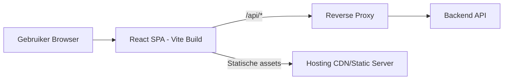
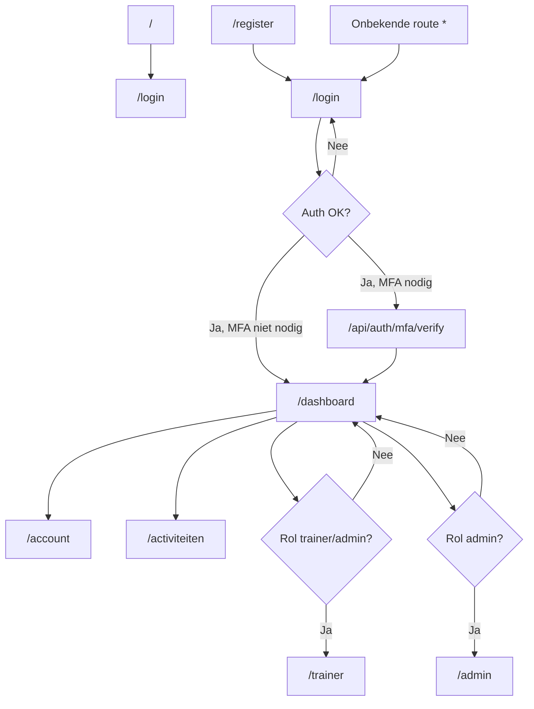

# SportPortal

Overzichtelijke frontend voor het SportPortal-platform, gebouwd met React + Vite.

## Inhoud

- [Features](#features)
- [Tech Stack](#tech-stack)
- [Snel Starten](#snel-starten)
- [Configuratie (Environment)](#configuratie-environment)
- [Scripts](#scripts)
- [Architectuur Diagram](#architectuur-diagram)
- [Route Diagram](#route-diagram)
- [Projectstructuur](#projectstructuur)
- [Deployment](#deployment)
- [Troubleshooting](#troubleshooting)

## Features

- Inloggen en registreren
- Dashboard en accountpagina
- Activiteiten/voting-pagina
- Rolgebaseerde toegang voor trainer en admin
- SPA-routing met fallback redirects

## Tech Stack

- React 18
- React Router 6
- Vite 8
- Node.js (voor productie preview/server script)

## Snel Starten

### 1) Vereisten

- Node.js 18+
- npm 9+

### 2) Installeren

```bash
npm install
```

### 3) Start development server

```bash
npm run dev
```

Frontend draait standaard via Vite op een lokale poort (meestal `5173`).

## Configuratie (Environment)

Maak een `.env` of `.env.local` aan in de projectroot.

```env
# In HTTPS/reverse-proxy omgevingen meestal dit gebruiken
VITE_API_BASE_URL=/api

# Doel voor Vite dev proxy (alleen lokaal development)
VITE_DEV_API_TARGET=http://10.10.10.21:3000
```

Belangrijk:

- Bij lokale API-calls via proxy loopt verkeer via `/api/*`.
- Registratie gebruikt `POST /api/auth/register`.

## Scripts

```bash
# Development
npm run dev

# Productie build
npm run build

# Preview van productie build
npm run preview

# Start node productie script
npm run start:prod
```

Build-output komt in `dist/`.

## Architectuur Diagram



## Route Diagram



## Projectstructuur

```text
sportportal/
  src/
    App.jsx
    main.jsx
    components/
      auth/
      account/
      admin/
      dashboard/
      trainer/
      voting/
      layout/
      ui/
    services/
      apiClient.js
    utils/
      auth.js
  public/
  ops/
  structure-overview/
  package.json
  vite.config.js
  index.html
```

## Deployment

### Optie A: Vercel (aanbevolen)

```bash
npm i -g vercel
vercel --prod
```

SPA-routes worden afgehandeld via `vercel.json`.

### Optie B: Netlify

```bash
npm run build
netlify deploy --prod --dir=dist
```

SPA-routes worden afgehandeld via `public/_redirects`.

### Optie C: Linux server met systemd

```bash
./ops/install-systemd-service.sh
sudo systemctl status sportportal.service
sudo journalctl -u sportportal.service -f
```

Service-eigenschappen:

- Automatische start na reboot
- Automatische herstart bij crash
- Draait op poort `4173`

### Backend + Frontend op aparte servers

Gebruik de runbook in `ops/DEPLOY_20_21_RUNBOOK.md` en zorg dat:

- Frontend `VITE_API_BASE_URL=/api` gebruikt
- Reverse proxy `/api/*` doorstuurt naar backend (`http://10.10.10.21:3000/*`)

## Troubleshooting

### API werkt lokaal niet

- Controleer `VITE_API_BASE_URL` en `VITE_DEV_API_TARGET`
- Controleer of backend bereikbaar is op de ingestelde target
- Controleer proxy settings in `vite.config.js`

### SPA routes geven 404 op hosting

- Vercel: check `vercel.json`
- Netlify: check `public/_redirects`

### Meer operationele documentatie

- `ops/HTTPS_PROXY_TROUBLESHOOTING.md`
- `ops/DEPLOY_20_21_RUNBOOK.md`
- `structure-overview/01-url-overzicht.md`
- `structure-overview/02-route-diagram.md`
