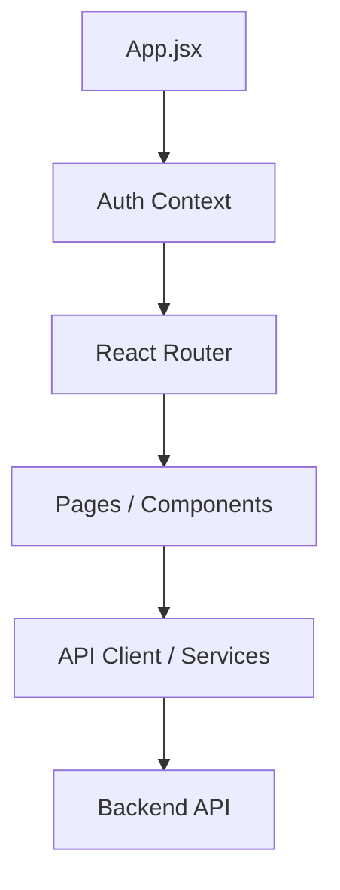

# 🎨 SportPortal Frontend

Een moderne, interactieve en veilige gebruikersinterface voor het SportPortal platform. Gebouwd met React en Vite, met een focus op gebruiksvriendelijkheid en een strakke visuele presentatie.

## 🌟 Kenmerken

- **Modern UI Design:** Gebruik van een "Magic Bento" grid lay-out en responsieve componenten.
- **Naadloze Authenticatie:** Geïntegreerde flows voor registratie, login en Multi-Factor Authentication (MFA).
- **Dashboard voor Iedereen:** Specifieke weergaven voor Sporters, Trainers en Administrators.
- **Real-time Validatie:** Directe feedback op formulieren, inclusief wachtwoordsterkte-indicatoren.
- **Passkey Integratie:** Ondersteuning voor inloggen met biometrische gegevens of hardware keys (Passkeys).
- **MAC-Adres Beheer:** Speciaal paneel voor administrators om vertrouwde apparaten te beheren.

## 🏗️ Architectuur

De frontend is modulair opgezet met een sterke scheiding tussen presentatie en logica:

- **Components:** Georganiseerd per domein (account, admin, auth, dashboard, trainer, voting).
- **Context API:** Centrale `AuthContext` voor het beheren van de gebruikerssessie en authenticatiestatus door de hele app.
- **Hooks:** Custom hooks zoals `useMacVerification` voor complexe herbruikbare logica.
- **Services:** Een robuuste `apiClient` die alle communicatie met de backend afhandelt, inclusief automatische foutafhandeling en CSRF-beveiliging.


```mermaid
graph TD
    App[App.jsx] --> AuthCtx[Auth Context]
    AuthCtx --> Router[React Router]
    Router --> Pages[Pages / Components]
    Pages --> Services[API Client / Services]
    Services --> BE[Backend API]
```

## 🛠️ Installatie & Gebruik

### Vereisten
- Node.js (v18 of hoger)
- Een draaiende SportPortal Backend

### Snel Starten
1. **Clone de repository**
2. **Installeer dependencies:**
   ```bash
   npm install
   ```
3. **Configureer `.env`:**
   Maak een `.env` bestand aan met de volgende variabele:
   ```env
   VITE_API_BASE_URL=http://localhost:3000
   ```
4. **Start de development server:**
   ```bash
   npm run dev
   ```
5. **Bouwen voor productie:**
   ```bash
   npm run build
   ```

## 🔐 Beveiliging

- **CSRF Bescherming:** Volledige ondersteuning voor SameSite cookie policies in samenwerking met de backend.
- **Veilig Sessiebeheer:** Tokens worden veilig afgehandeld door de browser en nooit direct in localStorage opgeslagen als ze gevoelig zijn.
- **XSS Preventie:** React's automatische escaping en strikte content policies.
- **MFA Flow:** Gebruiksvriendelijke QR-code activatie en verificatie schermen.

## 📄 Licentie
Dit project is privé eigendom en ontwikkeld voor SportPortal.
